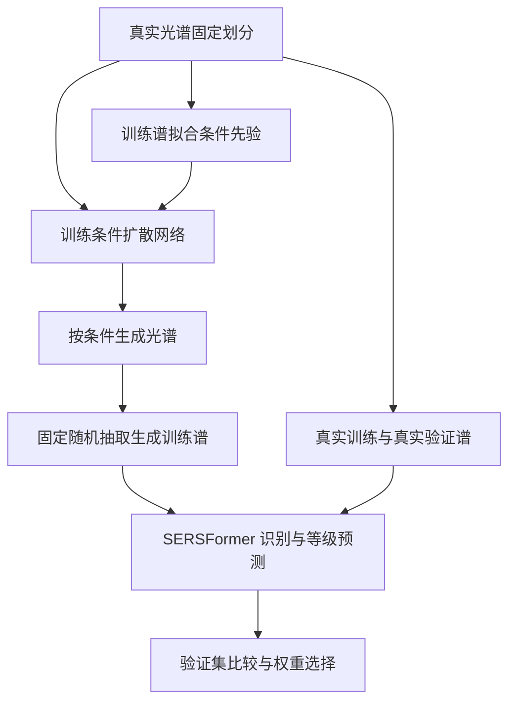
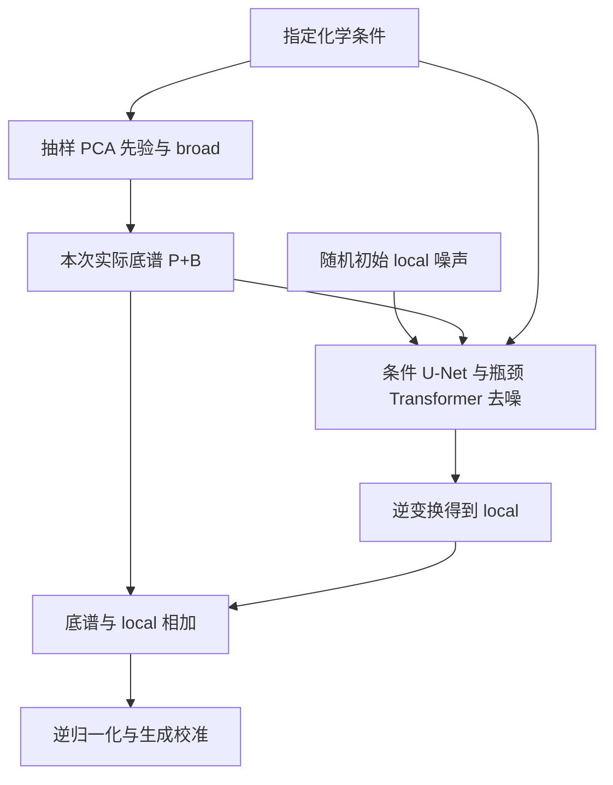
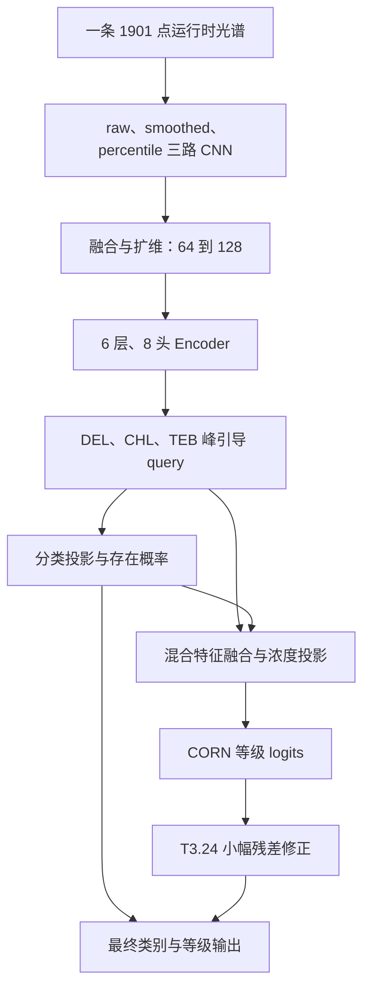

# D26+T24：先验残差扩散与峰引导 SERSFormer

本项目面向水和土壤中多种农药的 SERS 光谱分析，包含两个相互衔接的模型阶段：

1. **D4.26 条件扩散生成**：从少量真实训练谱建立条件先验，生成指定农药组合、浓度等级和基质的光谱，用于扩充训练集。
2. **T3.24 光谱识别与浓度等级预测**：输入一条光谱，判断 DEL、CHL、TEB 是否存在，并输出各组分的 S/M/H 浓度等级。

当前输入和生成对象均为**一维光谱数值序列**。横轴是 Raman 位移，纵轴是光谱强度；模型直接处理数值，不需要将光谱绘制为图片。

> **当前版本口径**：D4.26 使用卷积 U-Net 与瓶颈条件 Transformer 的混合结构；T3.24 基于已经训练的 T3.18 主模型开展局部浓度优化。当前推荐为 `residual_control` 第 2 轮，不是额外更新浓度融合模块的候选权重。S/M/H 是等级标签，当前结果不能直接解释为 mg/L 或其他物理浓度的连续定量结果。

## 1. 研究任务与数据组织

### 1.1 农药、浓度与基质

| 项目 | 设置 |
|---|---|
| DEL | 溴氰菊酯 |
| CHL | 百菌清 |
| TEB | 戊唑醇 |
| 浓度等级 | S、M、H；0 表示该组分不存在 |
| 混合类型 | 单组分、二元混合、三元混合 |
| 基质 | `water`、`soil` |
| 条件命名示例 | `DEL-M_TEB-H_CHL-S_soil` |

每种基质包含 9 个单组分条件、27 个二元条件、27 个三元条件，共 63 个条件。两种基质合计 **126 个具体条件**。

扩散阶段的一个共享模型学习全部条件，不为每个条件分别训练一套神经网络。每个条件有独立的统计先验，但去噪网络参数共享。

### 1.2 固定数据划分

真实数据共 126 个源文件，每文件 20 条谱，共 **2,520 条真实光谱**。

| 子集 | 每个条件的真实谱数 | 原始谱序号，以 1 开始 | 全部条件合计 |
|---|---:|---|---:|
| 训练 | 12 | 1–12 | 1,512 |
| 验证 | 4 | 13–16 | 504 |
| 测试 | 4 | 17–20 | 504 |

程序中的 `spectrum_index` 以 0 开始，因此对应索引为 0–11、12–15、16–19。当前采用**同一源文件内部固定划分**，并非按独立实验批次或独立样品来源划分。

扩散生成池通常为每个条件 200 条，共 25,200 条。当前识别实验从每个条件的 200 条生成谱中，按固定种子 `2026` 和条件身份确定性抽取 **48 条**，不是取前 48 条。

| T3.24 子集 | 真实谱 | 生成谱 | 总数 |
|---|---:|---:|---:|
| 训练 | 1,512 | 6,048 | 7,560 |
| 验证 | 504 | 0 | 504 |
| 测试 | 504 | 0 | 504 |

生成谱仅加入训练集。T3.24 的浓度修正尺度、特征标准化及参考模板仅使用真实训练谱拟合；验证时恢复已保存的参数，不重新拟合。本轮没有测试集特征缓存或测试预测。

### 1.3 Raman 轴与两种掩码

原始数据同时存在：

- 600–2500 cm⁻¹：1901 点，96 个条件文件。
- 600–2000 cm⁻¹：1401 点，30 个条件文件。

模型使用统一的 600–2500 cm⁻¹ 物理轴，步长为 1 cm⁻¹。两阶段对缺失尾部的处理需要分别理解：

| 阶段 | 短轴处理 | 掩码含义 |
|---|---|---|
| D4.26 扩散 | 使用 `union_with_valid_mask`，统一数组长度并屏蔽未测区；为 U-Net 下采样还会补齐到 1904 点 | `valid_mask` 决定哪些原始位置参与去噪监督；补齐位置不属于实测数据 |
| T3.18/T3.24 主模型 | 沿用仓库的内存补尾规则，以确定性、背景匹配的噪声补至 2500 cm⁻¹ | 主模型的 `valid_mask` 按运行时可用轴处理，不能一概解释为原始实测范围 |
| T3.24 局部谱窗修正 | 另外根据原始文件的起止位置建立 `measured_mask` | 排除原始未测区域的谱窗，避免将补尾噪声当作实测峰特征 |

补尾在内存中进行，不修改原始 Excel/CSV 文件。运行日志中的 RAW INPUT AXIS AUDIT 统计的是补尾前的文件范围。

## 2. 总体工作流程



两个阶段分别训练。当前流程不是将扩散模型和识别模型连接后端到端联合反向传播：扩散先生成数据，识别模型再使用真实谱和选出的生成谱训练。

## 3. D4.26：条件先验残差扩散模型

### 3.1 光谱分解与学习对象

在扩散模型的归一化空间内，令真实谱为 $X$，条件 PCA 重建先验为 $P$：

$$
R=X-P,\qquad B=\operatorname{GaussianSmooth}(R),\qquad L=R-B.
$$

因此有：

$$
X=P+B+L.
$$

| 成分 | 由什么得到 | 主要作用 |
|---|---|---|
| `P`：条件 PCA 先验 | 同条件训练谱的均值与主成分 | 提供该组合的整体光谱结构、主要强度变化及谱段之间的统计关系 |
| `B`：broad 残差 | 真实谱减去先验后，经高斯平滑提取；另用 PCA 建模其分布 | 表示残差中变化较平缓的部分，降低扩散网络需要直接学习的复杂度 |
| `L`：local 残差 | 剩余的局部残差 | 表示局部峰形差异、较快变化及部分噪声结构；是当前扩散网络的主要学习对象 |

`broad` 是按变化尺度定义的残差成分，并不等于原始光谱的基线；`local` 也不等于纯噪声。原谱整体接近水平，仍可能包含缓变残差与局部残差。

当前 broad 平滑尺度为 $\sigma=7$ cm⁻¹。outer PCA 与 broad PCA 是**两套分别拟合的统计模型**：前者拟合光谱先验，后者拟合 broad 残差；它们不是同一组 PCA 主成分。

主要实现：[conditional_prior_residual.py](diffusion/src/conditional_prior_residual.py)、[broad_local_residual.py](diffusion/src/broad_local_residual.py)。

### 3.2 条件先验库与留一交叉拟合

每个条件仅使用该条件的 12 条真实训练谱建立先验。当前 PCA 目标解释方差比例为 0.95，最多保留 6 个主成分；实际主成分数由该条件的数据决定。

训练采用 `leave_one_out` 交叉拟合：为某条训练谱构建 PCA 参考时，使用同条件其余 11 条训练谱拟合 PCA，再重建被留出的谱。随后在这些交叉拟合残差上拟合 broad/local 统计。

这样可以减少“训练谱先参与拟合 PCA，再被过度精确重建，导致训练残差过小”的问题。供验证、测试变换和生成使用的最终 PCA 状态仍由全部 12 条真实训练谱拟合，并保存到 checkpoint。

条件先验库在训练时返回两项配对数据：

- 待加噪的 local 残差。
- 与它来自同一条谱的实际重建底谱 $P+B$。

归一化包括训练集拟合的全局 min-max、local 的 `robust_asinh` 变换及 Raman 方向方差均衡。方差均衡用于减轻不同谱段残差尺度相差过大的影响，不改变各位置的物理 Raman 坐标。

### 3.3 14 维化学条件编码

14 维条件由三种农药各 4 个状态，加 2 个基质状态组成：

| 向量位置，以 0 开始 | 编码内容 |
|---|---|
| 0–3 | DEL：`0/S/M/H` 四状态 one-hot |
| 4–7 | TEB：`0/S/M/H` 四状态 one-hot |
| 8–11 | CHL：`0/S/M/H` 四状态 one-hot |
| 12–13 | 基质：`water/soil` one-hot |

扩散条件顺序为 **DEL、TEB、CHL**；识别输出顺序为 **DEL、CHL、TEB**，二者不能直接按列位置混用。

条件由源文件名解析。某组分编码为 `0` 就表示该组分不存在，因此混合组合已经由三个组分状态共同表达，不需要另加一个“混合类型 one-hot”。

条件向量通过可学习编码器映射到 32 维嵌入，既作为输入通道，也通过 FiLM 注入各 ResNet 块。FiLM 根据化学条件生成特征缩放和偏移，使同一个去噪网络在不同组合下产生不同响应。

实现：[spectrum_conditioning.py](diffusion/src/spectrum_conditioning.py)、[masked_unet.py](diffusion/src/masked_unet.py)。

### 3.4 卷积 U-Net 主干

U-Net 负责从带噪 local 残差预测干净 local 残差。

| 模块 | 功能 |
|---|---|
| 输入拼接 | 接收带噪残差、有效区掩码、实际底谱及化学条件嵌入 |
| 时间步嵌入 | 告知网络当前扩散噪声阶段 |
| 一维卷积与 ResNet 块 | 提取局部峰形、邻近位置变化和不同尺度的光谱特征 |
| 下采样 | 减少序列长度，扩大特征感受野 |
| 原有 attention | 保留后端 U-Net 已有的尺度内注意力与瓶颈注意力 |
| skip connections | 将下采样过程的细节特征传入上采样路径 |
| 上采样与输出卷积 | 恢复序列分辨率，输出 local 残差的预测 |

当前基础通道宽度为 32，倍率为 `[1,2,4]`，瓶颈宽度为 128。1901 点物理轴补齐到 1904 点后，四倍下采样得到 476 个瓶颈位置。

### 3.5 瓶颈条件 Transformer

D4.26 在原瓶颈 attention 之后、`mid_block2` 之前加入一个 `PriorBottleneckTransformer` 残差适配器。

| 设置 | 当前值 |
|---|---|
| Transformer 深度 | 1 |
| 隐藏维度 | 128 |
| 注意力头数 | 4 |
| 每头维度 | 32 |
| 前馈层维度 | 256 |
| Dropout | 0.05 |
| 自注意力 | 开启 |
| 底谱交叉注意力 | 开启，当前为 `cross` 变体 |
| 位置编码 | Raman 物理轴 Fourier 编码，8 组频率 |
| 条件调制 | 扩散时间步嵌入与化学条件嵌入共同调制 |

**自注意力**让残差瓶颈的不同谱段交换信息，学习远距离峰段之间的关联。

**交叉注意力**的 Q 来自残差瓶颈，K/V 来自这一条样本实际使用的 $P+B$ 底谱，经过有效区池化和投影得到。它帮助网络根据底谱状态预测与之匹配的 local 残差，而不是只根据组合标签生成一个独立残差。

**物理位置编码**使用固定 Raman 坐标。1401 点和1901 点光谱不会被各自重新缩放到同一套相对坐标，因此同一波数位置具有一致含义。

**掩码处理**排除新适配器中的无效 key，并将无效位置的更新归零；部分覆盖的边界 token 按有效覆盖率衰减。原 U-Net 后端的 attention 结构保持原样，不能据此宣称旧主干内部所有 attention 都已改成显式 masked attention。

**零初始化输出投影**使新适配器初始化时输出零增量。内部 attention 会在输出投影开始更新后获得梯度；这属于初始化设计，不代表模块没有训练。

包内架构验证登记的参数量为：旧 denoiser **1,346,881**，cross 候选 **1,688,385**，新增 **341,504**。该统计针对 denoiser 神经网络，不把条件 PCA 的统计缓冲当作可训练神经网络参数。

实现：[prior_bottleneck_transformer.py](diffusion/src/prior_bottleneck_transformer.py)。

### 3.6 前向加噪、反向生成与底谱配对

以变换后的干净 local 残差 $x_0$ 为扩散对象：

$$
x_t=\sqrt{\bar\alpha_t}\,x_0+\sqrt{1-\bar\alpha_t}\,\epsilon,
\qquad \epsilon\sim\mathcal N(0,I).
$$

当前目标为 `pred_x0`：网络直接预测干净 local 残差，而不是将完整原谱当作去噪目标。



生成时先为每条谱抽取底谱，整个反向去噪过程使用该底谱，最终重建仍使用**同一份底谱**：

$$
\widehat X=P_{\mathrm{sampled}}+B_{\mathrm{sampled}}+\widehat L.
$$

不能在去噪结束后另外抽取一份 PCA/broad 再相加，否则会破坏条件输入与重建的配对关系。

默认 PCA 与 broad score 独立抽样。源码也提供联合先验采样模块，但归档的 D4.26 cross 配置中 `generation.joint_prior_sampling.enabled=false`，不能把“代码支持联合采样”写成“当前已启用”。

### 3.7 损失、生成校准与启用状态

当前扩散训练采用 masked `pred_x0` 监督、Min-SNR 加权及条件多样性/保真约束。辅助项具有自己的权重和相对于 DDPM 主损失的预算上限。

| 模块 | 当前归档配置 | 作用 |
|---|---|---|
| 条件分组训练 | 启用，同条件组大小 4 | 为条件内距离、相关性和方差统计提供配对样本 |
| 低噪声残差多样性约束 | 启用 | 约束成对距离、过高相关性和逐点方差不足 |
| 多尺度形状与一阶导数保真 | 启用 | 约束重建的局部变化和多个尺度的形状 |
| 条件均值、逐点包络、组方差、尾部分布 | 启用 | 约束同条件样本分布及极端范围 |
| full-spectrum support | 启用 | 在完整重建空间约束明显超出训练支持范围的变化 |
| 独立 `physics_constraints` | 关闭 | 源码保留相应能力，当前不作为启用模块介绍 |
| 独立峰导数、相对峰强比、峰参数约束 | 关闭 | 不能与已启用的 quality-fidelity 内部导数项混为一谈 |
| `local_peak_distribution_constraints` | 关闭 | 当前训练未启用该独立模块 |
| `residual_aware_loss` | 关闭 | 当前不使用其独立训练损失 |
| 生成均值、PCA spread、尾部分位校准 | 启用 | 调整生成统计，并结合多样性保留规则限制校准幅度 |
| 强度包络与最终交付保护 | 启用 | 限制异常极值和明显不合理的负谷 |
| 采样后的额外峰抖动/峰高压缩套件 | 总开关关闭 | 子项配置存在，不等于实际执行 |
| 联合 outer/broad 抽样 | 关闭 | 当前归档配置沿用独立抽样 |

此表以 [cross/runtime_config.yaml](current_configs/D4.26/cross/runtime_config.yaml) 为准。这个文件是归档的训练/生成配置；后续独立生成任务如使用另一个运行时配置，应另行核对实际开关，不能仅凭本表推断该任务的设置。

`tail_calibration` 主要约束强度分布的分位尾部，与“600–2000 光谱补至 2500 cm⁻¹”的轴尾补全是不同操作。多样性保护的预算与门槛也不构成峰形质量或下游识别提升的保证。

轻微负值可以来自基线校正与残差结构；本项目没有把所有负值一律裁剪为零。

### 3.8 当前 D4.26 配置

| 参数 | 数值 |
|---|---|
| 共享训练条件数 | 126 |
| Epoch / batch size | 50 / 16 |
| 随机种子 | 2026 |
| 扩散步数 / 采样步数 | 200 / 100 |
| 噪声调度 | cosine |
| 目标 / 损失加权 | `pred_x0` / Min-SNR，gamma=5 |
| DDIM eta | 0.0 |
| 优化器 | AdamW，weight decay=0 |
| 最高 / 最低学习率 | 2e-4 / 1e-6 |
| Warmup | 总更新步数的 5%，起始学习率 1e-5 |
| 梯度裁剪 | L2 范数上限 1 |
| EMA | decay=0.995，每次优化器更新后更新 |
| 混合精度 | 关闭 |
| 生成权重来源 | EMA |
| 生成数量 | 每条件 200 条 |
| 物理 GPU | 1 |

EMA 保存随训练平滑更新的网络参数，用于生成；它不取代条件先验、归一化或掩码状态，这些状态同样需要随 checkpoint 恢复。

## 4. SERSFormer 主模型：局部特征与峰段关联

T3.24 的冻结基础模型来自 **T3.18 random48**，使用 T3.17 的扩维 Encoder 架构。阅读当前模型时，应以 [Model_T3_17.py](packages/T3_24_concentration_update/Model_T3_17.py) 及保存的 `base_model_config` 为准，不能只看 `transformer/Model_v2.py` 的默认构造参数。

### 4.1 三路输入与 CNN

对每条运行时光谱，先进行保留正负号的 `signed_log1p` 变换：

$$
f(x)=\operatorname{sign}(x)\log(1+|x|).
$$

| 路径 | 实际输入 | 功能 |
|---|---|---|
| raw | signed-log 后，在该条谱的运行时有效区 min-max 归一化 | 提取全谱局部形状与相对强度模式 |
| smoothed | signed-log 信号的 Hann 平滑结果 | 提取较稳定的峰段结构，降低局部噪声影响 |
| percentile | 95/85/75/50 四个分位阈值对应的 4 通道特征 | 提供不同强度层级的突出区域信息 |

百分位通道保留的是达到对应阈值的变换后强度，不是将一条光谱压缩成四个标量。raw 路径的逐谱 min-max 也不同于扩散阶段训练集拟合的全局 min-max。

三路分别经过两层 `Conv1d(kernel=3)` 与两次 `MaxPool1d(kernel=3)`，得到对齐的 token 序列。当前每路输出 `[B,210,64]`；三路拼接为 `[B,210,192]`，经线性融合、GELU、Dropout 和 LayerNorm 得到 `[B,210,64]`。

### 4.2 扩维与 Transformer Encoder

当前满足“先扩维，在高维空间完成 attention，再投影回预测特征”的设计：

| 步骤 | 张量形状或配置 |
|---|---|
| CNN 三路融合 | `[B,210,64]` |
| token 扩维 | `Linear(64,128)`，得到 `[B,210,128]` |
| 位置编码 | 固定正弦/余弦位置编码 |
| Encoder | 6 层，8 个注意力头，隐藏维度 128 |
| 每头维度 | 16 |
| 前馈层 | 256 维，GELU |
| Encoder dropout | 0.1 |
| 药物 query 与跨药物融合 | 都在 128 维中执行 |
| 分类、浓度末端投影 | 分别 `Linear(128,64)` |
| 等级输出头 | hidden=64，每种药物输出两个边界 logit |

该识别模型使用 Encoder，没有用于自回归序列生成的 Decoder。Encoder 从输入 token 产生 Q/K/V，自注意力建模全谱中不同区域的联系。

### 4.3 峰引导药物 Query Attention

模型为 DEL、CHL、TEB 分别学习一个 128 维 query。三个 query 都可以读取全部有效 Raman token，而不是各自只读取一个固定窗口。

训练谱形成的 `chemistry_hybrid` 软先验，以正向加性偏置加入 attention logits，优先提示候选化学峰段；它不是把其他有效谱段屏蔽掉的硬掩码。

| 药物 | 主要先验位置 cm⁻¹ | 辅助位置 cm⁻¹ |
|---|---|---|
| DEL | 1000、1600 | 1534、1216、1487、1125 |
| CHL | 2230 | 1298、1463、1013、827 |
| TEB | 1090、1597 | 813、1369、981、1578 |

这些位置用于提供注意力线索，不能作为每种农药浓度的独占读数。例如 1597 与 1600 cm⁻¹ 附近响应可能重叠，混合组分改变引起共享窗口变化是正常现象。

### 4.4 分类、混合特征融合与浓度等级头

分类分支对药物 query 分别预测存在概率，采用多标签 Sigmoid；一条光谱可以同时包含多种药物。

浓度分支使用 `MixtureAwareQueryFusion`：让每种药物 query 从其他药物 query 获取上下文，并根据**模型预测的存在概率**调节混合修正强度。跨 query attention 的对角位置被屏蔽，以显式读取其他药物的信息。分类分支保留自己的原始 query 路径。

融合仍在 128 维中完成，之后降至 64 维送入各药物的 ordinal head。当前没有启用 `adaptive_mixture_gate` 或 `boundary_specific_mixture_gate`。

CORN 将 S/M/H 视为有序等级。对每种实际存在的药物，用两个 logit 表示：

$$
p_{\ge M}=\sigma(z_0),\qquad
p_{\ge H}=\sigma(z_0)\sigma(z_1),
$$

其中第二个 sigmoid 对应 $P(H\mid\mathrm{level}\ge M)$。乘积形式保证 $p_{\ge H}\le p_{\ge M}$。

- S=1、M=2、H=3；0 表示不存在。
- 第一任务在所有实际存在的 S/M/H 样本上训练。
- 第二任务只在实际存在的 M/H 样本上训练。
- 不存在的组分不参与浓度损失。
- 等级采用累积概率的中位数阈值解码，再由预测类别决定最终是否置为 0。
- 连续输出 $1+p_{\ge M}+p_{\ge H}$ 是期望等级码，不能解释为物理浓度。



## 5. T3.24：固定主模型上的浓度优化

### 5.1 为什么保留原始模型

T3.18 主模型已经通过真实谱与生成谱的联合训练学习分类与等级任务。T3.24 从该 checkpoint 出发，固定共享 CNN、Encoder、峰引导 query、分类和原浓度路径，通过独立模块修正等级边界。

这样可以在比较浓度改动时保持分类输出完全一致，并随时回到原模型。它不意味着共享主干已被证明足够，也不代表全模型微调不可行；全模型微调属于后续独立实验。

### 5.2 局部谱窗证据

修正模块直接从原始强度提取 17 个谱窗，每个窗口为中心 ±24 cm⁻¹，共 49 点：

`813, 827, 981, 1000, 1013, 1090, 1125, 1216, 1298, 1369, 1463, 1487, 1534, 1578, 1597, 1600, 2230`。

每个窗口提取局部曲线，以及峰高、面积、质心、宽度、不对称性、RMS、局部背景均值、翼部噪声等统计，另加入窗口可用性及谱窗之间的软对数面积对比。

这些证据与原模型的浓度特征、分类概率和 ordinal logits 一起送入修正网络。它们帮助区分“某个共享峰变强”与“某种药物等级真正改变”。模型不将固定单峰高度等同于某种药物的浓度。

当前两组都使用 `no_reference`：虽然保留了兼容 T3.22 的参考匹配计算和特征位置，**72 维模板匹配特征在标准化后被置为零**，不作为当前修正依据。

`residual_control` 的实际残差网络输入维度为 1266。缓存还保留 384 维融合前 query，使两组共用 1650 维缓存格式；对照组不将这额外的 query 接入残差 MLP。

### 5.3 残差等级修正

修正网络为：

`Linear(1266,32) → GELU → Dropout(0.1) → Linear(32,6)`。

6 个输出对应三种药物的两个 CORN 边界。通过 $2\tanh(\cdot)$ 限制每个残差 logit 增量，最后加到固定原模型的 logits 上：

$$
z_{\mathrm{new}}=z_{\mathrm{anchor}}+\Delta z_{\mathrm{residual}}.
$$

最后一层权重与偏置初始化为零，使训练开始时修正量为零。尺度与标准化缓冲保存到 checkpoint，推理时恢复。

### 5.4 两个实验组的区别

| 项目 | `residual_control` | `concentration_update` |
|---|---|---|
| 原始 T3.18 网络 | 全部冻结 | 全部冻结 |
| 谱窗残差网络 | 训练 | 训练 |
| 浓度融合副本 | 不创建 | 从原模块复制并训练 |
| 等级头副本 | 不创建 | 从原模块复制并训练 |
| 浓度投影 | 固定 | 固定 |
| 分类输出 | 原模型输出 | 原模型输出 |
| 可训练参数 | 40,742 | 185,583 |
| 冻结参数 | 1,267,823 | 1,267,823 |
| 总参数 | 1,308,565 | 1,453,406 |
| 当前推荐 | 第 2 轮通过采用条件 | 没有通过采用条件，推荐退回原模型 |

主实验的额外变化为：

$$
\Delta z_{\mathrm{branch}}
=z_{\mathrm{copied\ path}}(q,p)-z_{\mathrm{original\ path}}(q,p),
$$

$$
z_{\mathrm{new}}=z_{\mathrm{anchor}}
+\Delta z_{\mathrm{residual}}+\Delta z_{\mathrm{branch}}.
$$

融合副本与等级头副本保持 `eval()` 以关闭其预训练路径的 dropout，但参数仍保留梯度并由优化器更新；`eval()` 不等于冻结。分支增量没有额外硬界限，变化惩罚作用于两条路径的总增量。

### 5.5 初始化复现修复

同权重在不同 CUDA 批次或不同梯度路径下，可能因浮点计算路径产生末位差异；靠近等级阈值时，微小差异也可能改变判断。

当前包含 `zero_t324.py` 及其测试：

- 对状态完全相同的复制路径，将初始化分支增量规范为零，并保留训练导数。
- 总修正量严格为零时，复用原模型等级概率。
- 检查分类与等级判断一致，保存 `zero_reproduction_audit.json`。
- 不依据真实验证标签选择分支，也不把训练后的微小更新统一抹去。

本轮服务器初始化审计通过：概率差异、修正量及解码等级变化均为 0。

### 5.6 训练损失与调度

两组使用相同目标：

$$
\mathcal L=0.7\,\mathcal L_{\mathrm{CORN}}
+0.02\,\operatorname{mean}_{\mathrm{present}}(\Delta z^2).
$$

这里的 $\Delta z$ 为总 logit 增量，仅在实际存在的组分上计算变化惩罚。当前不加入 T3.23 的 middle-grade 或 preservation 额外损失，也不加入冻结分类分支的优化项。

| 设置 | 两组共同值 |
|---|---|
| Epoch / batch size | 50 / 16 |
| 优化器 | Adam，weight decay=0 |
| 初始 / 最高 / 最低学习率 | 1e-6 / 1e-5 / 1e-7 |
| Warmup | 3 轮，1,419 次优化器更新 |
| 总更新数 | 每组 23,650 次 |
| 调度 | 按优化器更新步执行 warmup + cosine |
| 梯度裁剪 | L2 范数上限 1 |
| 真实谱 / 生成谱 CORN 权重 | 1 / 1 |
| 随机种子 | 2026 |
| 物理 GPU | 0 |

固定主干的输出预先缓存，训练主要发生在小模块中，因此速度较快。当前 `train_loss` 不能直接与从零训练主模型的“分类 + 浓度”联合损失数值比较。

## 6. 当前验证结果与推荐规则

### 6.1 指标定义

- **组分等级准确率 / head accuracy**：仅统计真实存在的组分，其等级头输出是否正确。
- **完整预测 / profile accuracy**：一条谱的三种最终输出都与真值相同，包括不存在组分的 0。
- **三元完整等级正确**：在三元样本上，三种药物的等级同时正确。
- **DEL-M 正确数**：指定 DEL 真值为 M 的子集中，DEL 等级判断正确的谱数。

这些指标用途不同，不能将“每个组分大多数正确”直接解释为“整条混合谱全部正确”。

### 6.2 正式训练结果

| 权重 | 全部组分等级正确 | 全部完整预测正确 | 三元全部等级正确 | 土壤三元全部等级正确 | 土壤三元 DEL-M 正确 |
|---|---:|---:|---:|---:|---:|
| 原始 T3.18 | 973/1152（84.46%） | 366/504 | 118/216 | 53/108 | 18/36 |
| 浓度分支更新，第 8 轮候选 | 982/1152（85.24%） | 373/504 | 120/216 | 55/108 | 20/36 |
| 残差对照，第 6 轮候选 | 979/1152（84.98%） | 371/504 | 121/216 | 55/108 | 19/36 |
| **残差对照，第 2 轮推荐** | **978/1152（84.90%）** | **370/504** | **119/216** | **54/108** | **19/36** |

当前推荐仅有小幅验证改善。与原模型逐条比较，DEL 修正 3 个等级判断，CHL 与 TEB 各修正 1 个，没有新增“原本正确、现在错误”的组分等级判断。分类概率保持原样。

推荐权重重新加载后的 504 条验证谱结果与训练结束时保存的推荐预测一致。这属于同一验证集上的重载复现，不是新增独立测试证据。

### 6.3 为什么候选与推荐不同

`best_candidate.pt` 保存按候选排名选出的权重；`recommended.pt` 必须额外通过保守采用规则：

1. 三元完整预测正确数和土壤三元 DEL-M 正确数都必须严格增加。
2. 总体、单元、二元、三元、水三元、土壤三元的组分正确数和完整预测正确数不得下降。
3. 总体、三元及水/土壤三元的各药物正确数不得下降。
4. 土壤 DEL-M 按 TEB=S/M/H 分层的 DEL 正确数不得下降。
5. 分类输出继续使用固定原模型结果。

主实验第 8 轮和对照第 6 轮，都在关键子组中出现退步，因此没有被推荐。主实验最终 `recommended.pt` 是原模型零修正回退；当前应保留的是 **`residual_control/checkpoints/recommended.pt`**。

这项规则约束子组计数，不等于对所有未来样本保证“不新增错误”。当前没有新增等级错误是本轮推荐权重的观察结果。

### 6.4 当前边界

三元混合浓度等级问题尚未明显解决。共享峰随其他组分等级变化是正常混合响应，需要综合多个谱段与混合上下文判断。

当前训练与验证改善不能证明生成谱已充分覆盖真实变化，也不能证明共享 CNN/Encoder 已丢失必要信息。验证集已用于多轮模型选择，最终泛化效果仍需保留测试集与更独立的数据评价。全模型低学习率微调是后续计划，尚不属于本分支已完成的实验结果。

## 7. 仓库结构与关键入口

| 路径 | 内容与职责 |
|---|---|
| `diffusion/` | `/home/wqzheng/project` 的当前扩散源码快照 |
| `transformer/` | `/home/wqzheng/project_transformer` 的当前识别源码快照 |
| `packages/D4_26_hybrid_unet/` | D4.26 架构升级、实验准备、检查、训练与对比入口 |
| `packages/T3_17_encoder_upgrade/` | 扩维、8 头、6 层 Encoder 及 random48 训练入口 |
| `packages/T3_22_reference_joint/` | 前一阶段联合修正与历史对照代码 |
| `packages/T3_23_protected_correction/` | 前一阶段保护修正与历史对照代码 |
| `packages/T3_24_concentration_update/` | 当前两组浓度优化、零变化复现修复与独立推理 |
| `current_configs/D4.26/cross/runtime_config.yaml` | 当前归档的 D4.26 cross 配置 |
| `current_configs/T3.24/` | 比较表、正式训练摘要及初始化审计 |
| `CURRENT_MODEL.json` | 当前 checkpoint 路径、SHA256、推荐组与轮次 |
| `SOURCE_SHA256.json` | 首次上传的源码与配置内容校验清单；不覆盖根 README |

| 核心文件 | 功能 |
|---|---|
| [model_builder.py](diffusion/src/model_builder.py) | 按配置组装去噪器和 masked diffusion |
| [masked_diffusion.py](diffusion/src/masked_diffusion.py) | 加噪、反向采样、掩码损失和条件约束接口 |
| [ddpm_trainer.py](diffusion/src/ddpm_trainer.py) | 优化器、学习率调度、EMA、验证及 checkpoint 管理 |
| [spectrum_generator.py](diffusion/src/spectrum_generator.py) | 条件采样、同底谱重建及生成校准 |
| [final_spectrum_delivery.py](diffusion/src/final_spectrum_delivery.py) | 生成交付阶段的极值保护 |
| [Dataset.py](transformer/Dataset.py) | 文件读取、固定划分、补尾、三路预处理与峰先验构建 |
| [Model_T3_17.py](packages/T3_24_concentration_update/Model_T3_17.py) | 当前扩维 SERSFormer 基础架构 |
| [Model_T3_24.py](packages/T3_24_concentration_update/Model_T3_24.py) | 固定原模型、谱窗特征、残差修正和浓度副本 |
| [Loss_T3_24.py](packages/T3_24_concentration_update/Loss_T3_24.py) | 两组匹配的 CORN 与总 logit 变化惩罚 |
| [engine_t324.py](packages/T3_24_concentration_update/engine_t324.py) | 缓存、训练、指标、错误转移与采用规则 |
| [data_t324.py](packages/T3_24_concentration_update/data_t324.py) | 样本身份审计和原始实测范围掩码 |
| [zero_t324.py](packages/T3_24_concentration_update/zero_t324.py) | 初始零变化复现审计 |

历史 `.patch`、`.before_*` 及测试 fixture 用于追溯与验证，不是当前主运行入口。数据与 checkpoint 没有上传到此分支。

## 8. 环境与运行方法

### 8.1 已使用的服务器环境

| 项目 | 环境 |
|---|---|
| 系统 | Ubuntu 24.04 |
| Python | 3.11 |
| PyTorch | 2.11.0 + CUDA 12.8 |
| Conda | `sers_ddpm` |
| GPU | 2 × RTX 3090，24 GB |
| 扩散 / 识别 GPU | 物理 GPU 1 / 物理 GPU 0 |

U-Net 适配器按 `denoising-diffusion-pytorch` 2.2.6 后端 forward 结构实现。重新部署时应核对该依赖与仓库要求，不能任意更换后端后仍假定适配器行为相同。

### 8.2 克隆与部署说明

```bash
git clone --branch 'D26+T24' --single-branch \
  git@github.com:ZhengJoyeux/sers-diffusion-transformer.git
```

本分支是源码快照，不是包含数据、权重与所有历史实验的即开即用发布包。原服务器部署关系为：

- `diffusion/` 对应 `/home/wqzheng/project`。
- `transformer/` 对应 `/home/wqzheng/project_transformer`。
- `packages/` 内各包对应 `/home/wqzheng/` 下同名目录。

不要为阅读新分支而直接覆盖正在运行的原项目。完整复现实验还需要恢复真实数据、生成池、当前权重和必要的历史实验。T3.24 入口会检查 T3.18、T3.22、T3.23 的已知结果与 checkpoint，单靠 Git clone 不能满足这些依赖。

### 8.3 原服务器运行 D4.26

已有正式 suite 的路径为：

`/home/wqzheng/project/outputs/experiments/d4_26_hybrid_e50_b16_seed2026_20261005_153523_720760`。

检查已有 suite：

```bash
conda activate sers_ddpm
cd /home/wqzheng/project

python -u /home/wqzheng/D4_26_hybrid_unet/run_experiment.py \
  --suite /home/wqzheng/project/outputs/experiments/d4_26_hybrid_e50_b16_seed2026_20261005_153523_720760 \
  --phase check --variant cross --physical-gpu 1
```

需要从已有 checkpoint 继续训练时，才使用同一 suite 的 `--phase train --variant cross --resume --physical-gpu 1`。该命令是续训，不是创建一个新的从零训练对照。

新实验应通过 [prepare_run.py](packages/D4_26_hybrid_unet/prepare_run.py) 建立独立 suite，并按包内说明提供 baseline experiment 与 paired review；当前正式设置为 50 轮、batch size 16。包内早期 README 出现的 25 轮示例属于早期候选设置，应以当前归档配置为准。

### 8.4 检查及运行 T3.24

在原服务器、已有数据与历史实验保持完整的前提下：

```bash
conda activate sers_ddpm
cd /home/wqzheng/project_transformer

CUDA_VISIBLE_DEVICES=0 bash /home/wqzheng/T3_24_concentration_update/run_t324.sh check && \
CUDA_VISIBLE_DEVICES=0 bash /home/wqzheng/T3_24_concentration_update/run_t324.sh smoke && \
CUDA_VISIBLE_DEVICES=0 bash /home/wqzheng/T3_24_concentration_update/run_t324.sh train
```

`check` 使用人工数据检查结构、梯度及复现；`smoke` 是小规模流程验证，不能作为正式推荐结果；`train` 默认依次运行两组各 50 轮。已有正式结果不需要因为更新 README 而重新训练。

### 8.5 验证当前推荐权重

```bash
conda activate sers_ddpm
cd /home/wqzheng/project_transformer

CUDA_VISIBLE_DEVICES=0 bash /home/wqzheng/T3_24_concentration_update/run_t324.sh evaluate \
  --checkpoint /home/wqzheng/project_transformer/outputs/t3_24_concentration_update_train_20261009_203833_2694678/residual_control/checkpoints/recommended.pt
```

这个入口仅评价真实验证集，恢复已拟合状态，不执行测试集评价。T3.24 checkpoint 使用本包加载，不能直接传给旧版 `transformer/Inference.py`。

### 8.6 保留与恢复原模型

```bash
conda activate sers_ddpm
bash /home/wqzheng/T3_24_concentration_update/run_t324.sh restore
```

`restore` 校验原模型和源文件仍完整；当前实验没有覆盖原模型，所以正常情况下无需反向替换文件。T3.24 的推荐选择也不会自动把原项目默认推理入口切换为新权重。

## 9. 权重、报告与校验

当前权重身份记录在 [CURRENT_MODEL.json](CURRENT_MODEL.json)。

| 模型 | 服务器 checkpoint |
|---|---|
| D4.26 cross | `/home/wqzheng/project/outputs/experiments/d4_26_hybrid_e50_b16_seed2026_20261005_153523_720760/cross/checkpoints/best.pt` |
| T3.24 推荐 | `/home/wqzheng/project_transformer/outputs/t3_24_concentration_update_train_20261009_203833_2694678/residual_control/checkpoints/recommended.pt` |

T3.24 结果摘要见 [comparison.md](current_configs/T3.24/comparison.md)、[residual_control/run_summary.json](current_configs/T3.24/residual_control/run_summary.json) 与 [zero_reproduction_audit.json](current_configs/T3.24/zero_reproduction_audit.json)。

正式服务器输出还包含逐条预测、各条件指标、真实/生成来源拆分、错误修正与新增错误、九个土壤 DEL-M 组合、训练曲线和参数变化报告。`latest_parameter_changes.csv` 描述最后一轮，不应被当作最佳候选或推荐轮次的参数变化记录。

`SOURCE_SHA256.json` 描述首次上传时的源码及配置内容。单独更新根 `README.md` 不需要更改这个清单；改动被清单覆盖的代码时，应重新生成相应校验记录。

## 10. 已实现能力与后续工作

**已实现：**

- 全部 126 条件共享的一维条件扩散生成。
- 条件 PCA、交叉拟合、broad/local 分解与同底谱配对重建。
- 卷积 U-Net 局部建模、瓶颈全局 self-attention 与实际底谱 cross-attention。
- 混合 Raman 范围处理、有效区约束、EMA 生成与可配置分布校准。
- 真实谱与固定随机选出的生成谱联合训练识别主模型。
- 三路 CNN、64→128 扩维、6 层 8 头 Encoder、药物专属峰引导 query。
- 多标签存在判断、混合特征融合与 CORN 浓度等级预测。
- 固定主模型上的谱窗残差修正、同学习率对照及保守推荐规则。
- 源码、样本身份、原始权重和初始化零变化的审计。

**后续工作：**进一步解决三元混合等级归属与组间退步；开展全模型低学习率微调对照；继续检查生成谱的峰形、条件内多样性和真实分布覆盖；在模型选择结束后评价保留测试集，并补充更独立的样品或实验批次验证。
